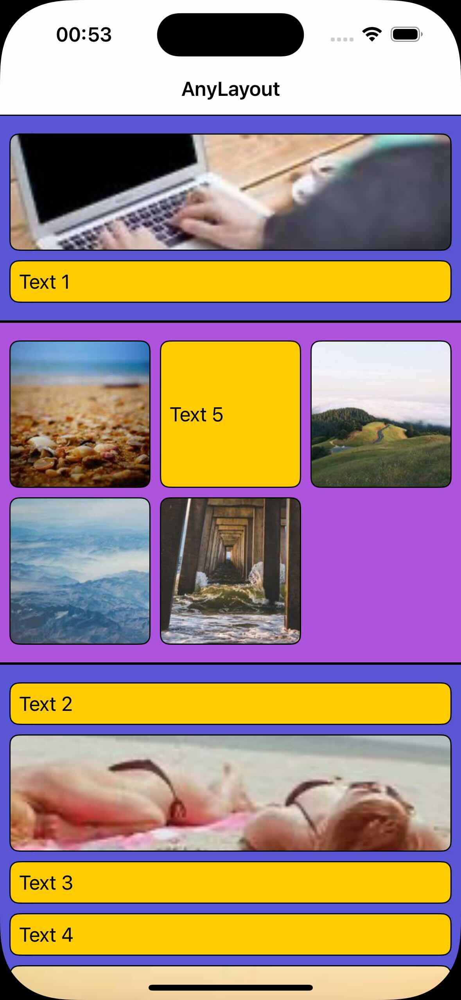

# AnyLayout

Create dynamic and modern collections effortlessly without relying on enums with **AnyLayout**.

**AnyLayout** simplifies building UI collections using `UICollectionViewCompositionalLayout` with type erasure for flexibility.

## Demo


## Installation

Integrate AnyLayout into your project using Swift Package Manager:

**Xcode > File > Add Package Dependencies.. :** https://github.com/OfTheWolf/AnyLayout.git

## Getting Started

1. Inherit from `CollectionViewController`.

2. Define sections conforming to `SectionProviding`. Implement the `layout` method to configure the section layout.

```swift
struct ListSection: SectionProviding {
    let id = UUID()
    
    // Define section layout here
    func layout(_ sectionIndex: Int, _ layoutEnvironment: NSCollectionLayoutEnvironment) -> NSCollectionLayoutSection {
        // Configure section layout
    }
}
```

3. Define items conforming to `ItemProviding`.

```swift
struct TextItem: ItemProviding {
    let text: String
}
```

4. Implement cell registration and dequeueing.

```swift
extension TextCell: Registering {
    typealias Cell = TextCell
    typealias Item = TextItem

    /// Boilerplate code
    static var registration: UICollectionView.CellRegistration<Cell, AnyItem> = UICollectionView.CellRegistration<Cell, AnyItem> { cell, indexPath, itemIdentifier in
        let data: Item = itemIdentifier.resolve()
        cell.configure(with: data)
    }
}

extension TextCell: Dequeueing {
    /// Boilerplate code
    static func dequeueCell(_ collectionView: UICollectionView, indexPath: IndexPath, item: AnyItem) -> UICollectionViewCell {
        return collectionView.dequeueConfiguredReusableCell(using: Self.registration, for: indexPath, item: item)
    }
}
```

5. Register your cell types with their corresponding item types.

```swift
//    MARK: - Override
    override func registerCells(for collectionView: UICollectionView) {
        collectionView.register(cell: ImageCell.self, item: ImageItem.self)
        collectionView.register(cell: TextCell.self, item: TextItem.self)
    }
```

6. Prepare the snapshot with your data. 

```swift
    private func loadData() {
        var snap = NSDiffableDataSourceSnapshot<AnySection, AnyItem>()
        Mock.data.forEach { data in
            snap.appendSections([data.section.eraseToAnySection])
            snap.appendItems(data.items.map(\.eraseToAnyItem))
        }
        dataSource.apply(snap)
    }
```

7. Build and run your project.

Start building your dynamic UI collections with ease using AnyLayout!
